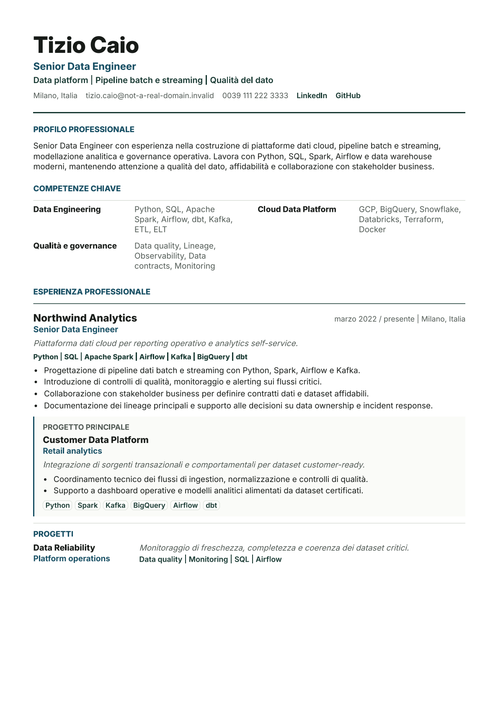
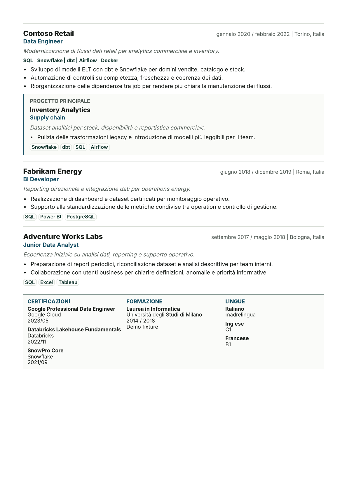
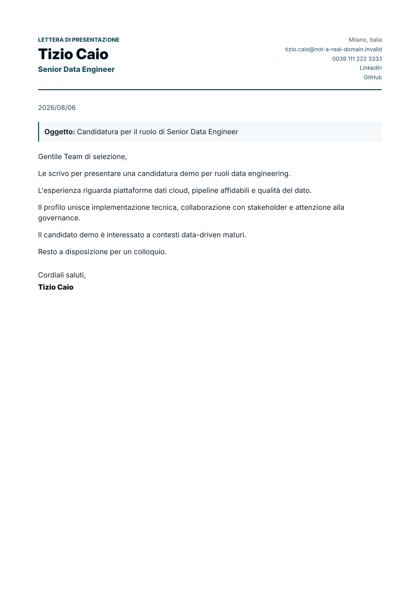

# CV as Code


Generate recruiter-ready CV and cover-letter PDFs from YAML.

CV as Code is a Java CLI that turns structured candidate data into localized, ATS-conscious PDF documents through an HTML to PDF pipeline. It keeps the CV versionable, repeatable and editable without touching Java code.

## Generate Now

```bash
git clone https://github.com/mattiacozzolino/cv-as-code.git
cd cv-as-code

./mvnw clean package

java -jar target/cv-as-code.jar generate-all \
  --config ./test-fixtures/tizio-caio/config \
  --output ./demo-output/tizio \
  --mode production \
  --exclude-photo

java -jar target/cv-as-code.jar inspect \
  --pdf ./demo-output/tizio/Tizio_Caio_CV_IT.pdf
```

The demo command generates:

- `Tizio_Caio_CV_IT.pdf`
- `Tizio_Caio_CV_EN.pdf`
- `Tizio_Caio_Cover_Letter_IT.pdf`
- `Tizio_Caio_Cover_Letter_EN.pdf`
- JSON validation reports under `demo-output/tizio/reports/`

## Create Your CV

```bash
java -jar target/cv-as-code.jar init --target ./my-resume
```

Edit the files under `my-resume/config/`, replace placeholder contacts in `private.yaml`, then run:

```bash
java -jar target/cv-as-code.jar validate \
  --config ./my-resume/config \
  --mode production

java -jar target/cv-as-code.jar generate-all \
  --config ./my-resume/config \
  --output ./my-resume/output \
  --mode production
```

`private.yaml` is ignored by Git and is the only place for real contact data, private photo paths and signature settings.

## Preview

Generated from the anonymized Tizio Caio fixture:





## Candidate Workspace

`init` creates this structure:

```text
my-resume/
├── config/
│   ├── candidate.yaml
│   ├── resume.yaml
│   ├── cover-letter.yaml
│   ├── settings.yaml
│   ├── application.example.yaml
│   └── private.yaml
├── assets/
│   └── photo-placeholder.png
└── README.md
```

The intended editing surface is small:

- `candidate.yaml`: name, title, positioning and location.
- `resume.yaml`: summary, skills, experience, projects, certifications, education and languages.
- `cover-letter.yaml`: generic cover letter text.
- `settings.yaml`: page limits, section visibility, photo behavior, privacy and accent color.
- `private.yaml`: email, phone, links, private photo path and signature.

## Photo, Signature And Privacy

Photo support is official and requires no template editing:

```yaml
photo:
  path: "../assets/private/photo.png"
```

Photo language defaults are controlled from `settings.yaml`:

```yaml
document:
  resume:
    includePhoto:
      it: true
      en: false
```

Put `photo.path` in `private.yaml` only. Use relative paths only. The standard asset folder is `assets/`; if the private photo is missing or blank, the renderer falls back to `assets/photo-placeholder.png`.

Signature belongs in `private.yaml`, because a future signature image is private candidate data:

```yaml
signature:
  enabled: true
  name: ""
  imagePath: ""
```

Privacy is controlled from `settings.yaml`:

```yaml
privacy:
  enabled:
    it: true
    en: false
  text:
    it: "Autorizzo il trattamento..."
    en: "I authorize the processing..."
```

`signature.name` falls back to the candidate name. `signature.imagePath` is reserved for a future image signature and must be relative. The Italian privacy note is enabled by default; the English one is disabled by default. When privacy is enabled, the localized `privacy.text` value must be configured in YAML.

Localized fields use this shape:

```yaml
summary:
  it: "Profilo professionale in italiano."
  en: "Professional profile in English."
```

Minimal experience example:

```yaml
experiences:
  - company: "Example Company"
    role:
      it: "Senior Software Engineer"
      en: "Senior Software Engineer"
    startDate: "2024-01"
    endDate:
    location:
      it: "Milano, Italia"
      en: "Milan, Italy"
    highlights:
      - it: "Contributo concreto, misurabile e rilevante."
        en: "Concrete, measurable and relevant contribution."
    technologies: ["Java", "Spring Boot", "PostgreSQL"]
```

## Commands

```bash
java -jar target/cv-as-code.jar --help
java -jar target/cv-as-code.jar init --target ./my-resume
java -jar target/cv-as-code.jar validate --config ./my-resume/config --mode production
java -jar target/cv-as-code.jar generate-cv --language it --config ./my-resume/config --output ./my-resume/output
java -jar target/cv-as-code.jar generate-cover-letter --language en --config ./my-resume/config --output ./my-resume/output
java -jar target/cv-as-code.jar generate-all --config ./my-resume/config --output ./my-resume/output --mode production
java -jar target/cv-as-code.jar inspect --pdf ./my-resume/output/Name_Surname_CV_IT.pdf
java -jar target/cv-as-code.jar preview --pdf ./my-resume/output/Name_Surname_CV_IT.pdf --output ./my-resume/output/preview
```

## Customize The Template

The default template is intentionally simple:

- `src/main/resources/templates/resume.html`
- `src/main/resources/templates/cover-letter.html`
- `src/main/resources/styles/resume.css`

Keep the HTML order linear, keep text selectable, and run `./mvnw verify -Dcv.e2e=true` after changing rendering or CSS.

## How It Works

```text
YAML configuration
↓
Configuration validation
↓
Localized view model
↓
Thymeleaf HTML rendering
↓
Playwright / Chromium PDF generation
↓
PDFBox inspection
↓
PDF + JSON validation report
```

The backend stays deliberately small: YAML repositories, validators, view-model assembly, Thymeleaf templates, Playwright rendering and PDFBox validation.

## Design And ATS Rules

The default template is designed as an editorial CV, not a web dashboard:

- linear DOM order;
- selectable text;
- no sidebar;
- no timelines, ratings, charts or decorative metrics;
- technology keywords rendered as readable text;
- optional photo controlled by YAML;
- two-page CV limit by default;
- one-page cover-letter limit by default.

Validation checks practical ATS signals: text extraction, candidate identity, title, contacts, section order, page count, encoding, expected companies and readable technology keywords.

## Testing

```bash
./mvnw test
./mvnw verify -Dcv.e2e=true
```

The E2E suite generates the main sample and the independent Tizio Caio fixture. The fixture test fails if previous-candidate strings leak into the generated PDF.

## Regenerate Preview Images

```bash
java -jar target/cv-as-code.jar generate-all \
  --config ./test-fixtures/tizio-caio/config \
  --output ./demo-output/tizio \
  --mode production \
  --exclude-photo

java -jar target/cv-as-code.jar preview \
  --pdf ./demo-output/tizio/Tizio_Caio_CV_IT.pdf \
  --output ./assets/previews \
  --prefix tizio-cv

java -jar target/cv-as-code.jar preview \
  --pdf ./demo-output/tizio/Tizio_Caio_Cover_Letter_IT.pdf \
  --output ./assets/previews \
  --prefix tizio-cover-letter
```

Only anonymized preview images are versioned.

## Roadmap

- Publish signed release artifacts.
- Add schema export for editor autocomplete.
- Add a small guided CLI wizard for non-technical users.
- Keep the project a CLI, not a web platform.

## FAQ

**Can I use it without editing Java?**  
Yes. Edit YAML files under `config/`.

**Can I use a photo?**  
Yes. Put images under `assets/`, configure a relative path, and control language defaults from `settings.yaml`.

**Can I disable privacy or signature?**  
Yes. Set `privacy.enabled.it/en` in `settings.yaml` and `signature.enabled` in `private.yaml`.

**Does it produce an ATS score?**  
No. It validates practical extraction and layout signals, then leaves content judgment to the candidate.

**Where should real contacts go?**  
Only in `private.yaml`, which is ignored by Git.

## Contributing

See [CONTRIBUTING.md](CONTRIBUTING.md). Keep candidate data configurable, avoid candidate-specific layout rules, and do not commit generated PDFs or private contacts.

## Requirements

- Java 17 or newer.
- Maven Wrapper from this repository.
- Chromium installed by Playwright.

Install Chromium when needed:

```bash
./mvnw -q exec:java \
  -Dexec.mainClass=com.microsoft.playwright.CLI \
  -Dexec.args="install chromium"
```

## License

MIT. See [LICENSE](LICENSE).
